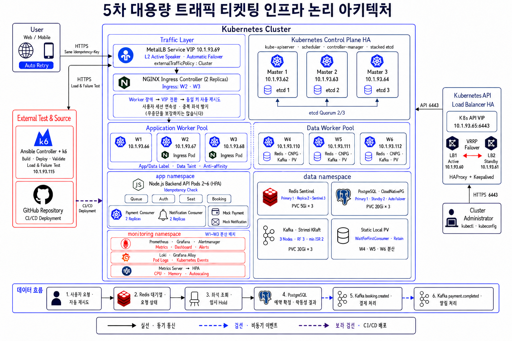

# Ticket Rail - On-Premise Kubernetes Infrastructure

온프레미스 Kubernetes 기반 티켓 예매 서비스 팀 프로젝트에서 제가 담당한 **외부 트래픽 진입 구조, Kubernetes 애플리케이션 배포 환경, 고가용성 구성 및 장애 검증**을 중심으로 재구성한 포트폴리오 저장소입니다.

> 이 저장소는 팀 프로젝트 전체 소스가 아닙니다. 개인 담당 범위와 직접 관련된 구성 파일을 중심으로 선별했으며, 팀 공용 Ansible 자료는 별도 디렉터리에 구분했습니다. CI/CD 파이프라인 구현은 개인 담당 범위에 포함하지 않았습니다.

## 1. 담당 업무

- Kubernetes 애플리케이션 배포 및 Service 구성
- MetalLB 설치 및 외부 VIP `10.1.93.69` 구성
- NGINX Ingress Controller 구축 및 이중화 구성
- Ingress 기반 외부 트래픽 라우팅
- HTTP 구성 이후 인증서 문제를 검토하고 HTTPS 접근 구조로 전환
- 외부 HTTPS 접근 및 Health Check 검증
- Ingress Controller Pod 1개 장애 상황에서 서비스 지속 여부 검증
- Worker Node 장애 상황에서 서비스 지속 및 MetalLB VIP 이동 검증
- Kubernetes 구축/배포 과정에서 사용한 일부 Ansible 자동화 자료 검토 및 활용

## 2. 전체 아키텍처

> 아래 이미지는 팀 프로젝트의 전체 인프라 아키텍처입니다.  
> 이 저장소에서는 전체 구성 중 제가 담당한 **MetalLB, NGINX Ingress Controller, Kubernetes 애플리케이션 배포 및 장애 검증 영역**을 중심으로 정리했습니다.



### 담당 영역의 트래픽 흐름

```text
Client
  |
  | HTTPS
  v
MetalLB VIP (10.1.93.69)
  |
  v
NGINX Ingress Controller (2 Pods)
  |
  v
Ingress Rule
  |
  v
Backend Service
  |
  v
Backend Pods
```

온프레미스 환경에서는 클라우드처럼 `LoadBalancer` 타입 Service에 외부 IP가 자동 할당되지 않기 때문에 MetalLB를 사용했습니다. MetalLB가 외부 진입용 VIP를 제공하고, NGINX Ingress Controller가 Host/Path 규칙에 따라 요청을 Kubernetes 내부 Service로 전달하도록 구성했습니다.

## 3. 기술 선택 이유

### MetalLB

온프레미스 Kubernetes에서 `LoadBalancer` Service에 사용할 외부 IP를 제공하기 위해 도입했습니다. L2 방식으로 VIP를 광고하여 클러스터 외부에서 Ingress Controller에 접근할 수 있도록 구성했습니다.

### NGINX Ingress Controller

서비스별로 외부 IP를 각각 노출하는 대신 하나의 진입 지점에서 HTTP/HTTPS 요청을 받아 내부 Service로 라우팅하기 위해 사용했습니다. Ingress Controller를 2개의 Pod로 구성하여 단일 Pod 장애가 즉시 서비스 중단으로 이어지지 않도록 했습니다.

### HTTPS

초기 HTTP 구성 이후 인증서 및 실제 접근 구조를 검토하면서 HTTPS 기반으로 외부 접근 경로를 구성했습니다. 최종적으로 Ingress VIP를 통한 HTTPS 요청과 Health Check가 정상적으로 응답하는지 확인했습니다.

## 4. 장애 검증

### Ingress Controller Pod 장애

Ingress Controller Pod가 2개 실행되는 상태에서 1개 Pod를 제거하고 외부 요청을 지속했습니다. 남아 있는 Ingress Controller를 통해 요청이 계속 처리되는지 확인하여 Ingress 계층의 이중화 동작을 검증했습니다.

### Worker Node 장애

Worker Node 장애 상황을 발생시킨 뒤에도 외부 트래픽이 정상적으로 처리되는지 확인했습니다. 동시에 MetalLB VIP의 위치 변화를 확인하여 장애 상황에서 외부 진입 경로가 유지되는지 검증했습니다.

> 당시 검증의 핵심은 장애 발생 전후의 서비스 연속성과 VIP 이동 확인이었습니다. 복구 시간, 실패 요청 수 등 세부 정량 지표는 별도 후속 측정 항목으로 구분했습니다.

## 5. 저장소 구조

```text
ticketing-infra/
├── kubernetes/
│   ├── app/              # Deployment, Service, ConfigMap, HPA
│   ├── ingress/          # Ingress 및 NGINX 설정
│   └── metallb/          # MetalLB 설치 및 VIP/L2 설정
├── ansible/
│   └── team-reference/   # 팀 공용 Kubernetes 구축 자동화 참고 자료
├── docs/
│   ├── images/
│   │   └── architecture.png
│   ├── contribution.md
│   └── validation.md
├── .gitignore
└── README.md
```

## 6. 코드 확인 포인트

- `kubernetes/metallb/`: 온프레미스 환경의 외부 VIP 제공 방식
- `kubernetes/ingress/`: NGINX Ingress Controller와 애플리케이션 라우팅 설정
- `kubernetes/app/`: Backend Deployment/Service/HPA 등 애플리케이션 배포 구조
- `ansible/team-reference/`: 클러스터 구축 과정에서 사용된 팀 공용 자동화 자료. 개인 단독 작성 코드로 표시하지 않음

## 7. 프로젝트를 통해 확인한 점

단순히 Kubernetes 리소스를 배포하는 것에서 끝내지 않고, 외부 사용자의 요청이 `MetalLB → NGINX Ingress → Service → Pod`로 전달되는 전체 경로를 이해하고 구성했습니다.

또한 실제 Ingress Controller Pod와 Worker Node에 장애 상황을 발생시켜 정상 상태에서의 동작 확인뿐만 아니라, 장애 상황에서도 외부 서비스 진입 경로가 유지되는지를 검증했습니다.

이를 통해 개별 Kubernetes 리소스의 구성뿐만 아니라 **외부 트래픽 진입부터 애플리케이션 Pod까지 이어지는 인프라 전체 흐름과 고가용성 구성의 동작 방식**을 확인할 수 있었습니다.

## 8. 공개 범위

포트폴리오 공개본에서는 Secret, Private Key, `.env`, kubeconfig, 로그, 백업, 테스트 증적 원본 및 CI/CD 관련 자료를 제외했습니다. 실제 운영 또는 재구축 시에는 환경별 IP, 도메인, 인증서 및 보안 설정을 별도로 적용해야 합니다.